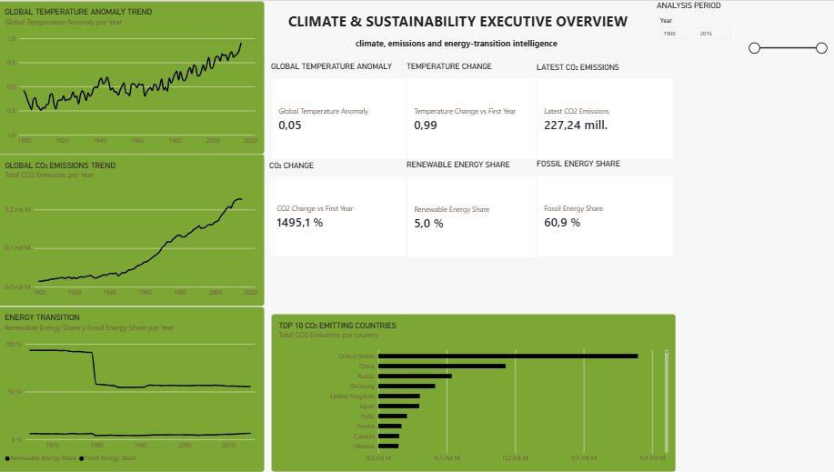
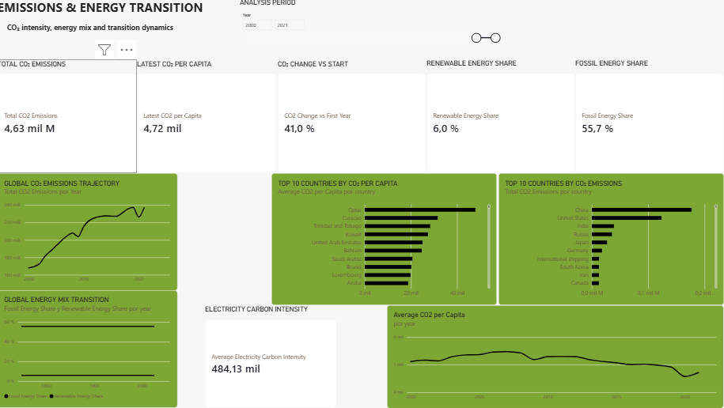
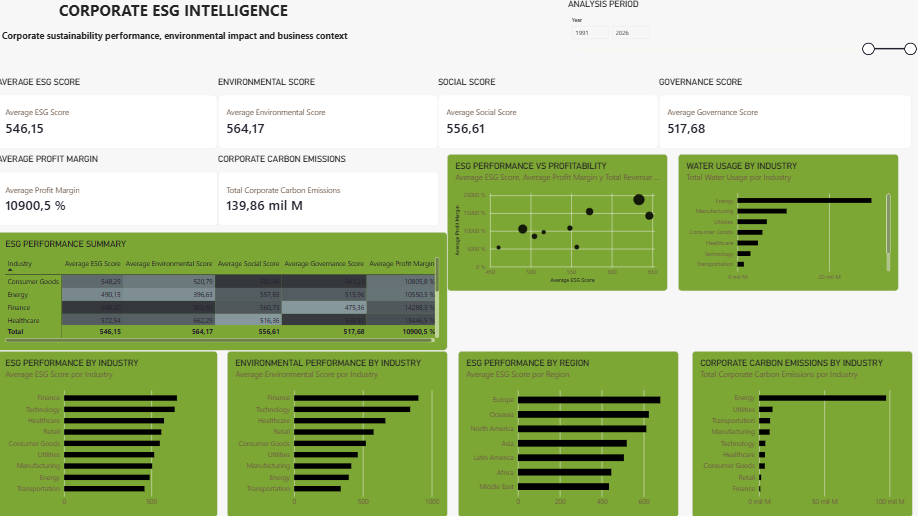
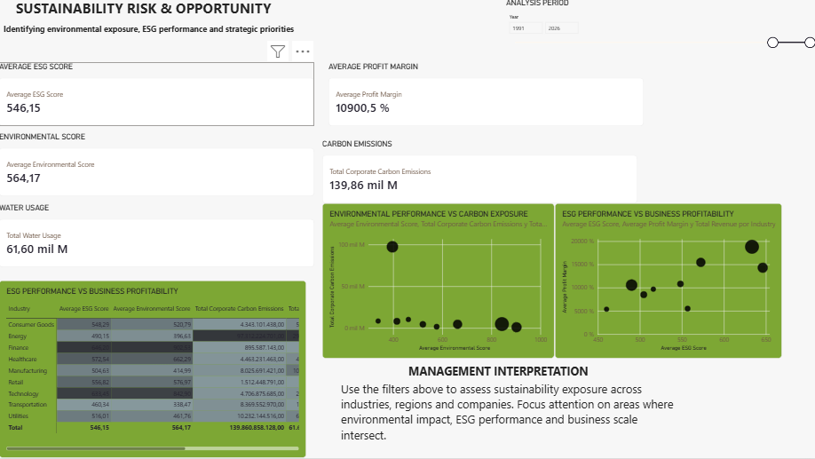
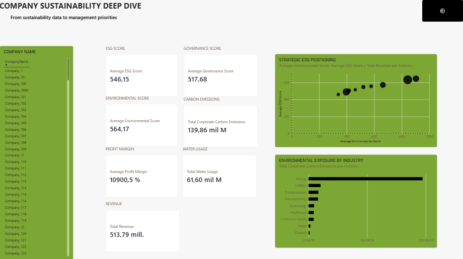

# Climate & Sustainability Intelligence

## Executive Overview

An interactive Power BI dashboard designed to transform climate, emissions and energy data into decision-ready sustainability insights.

The project combines environmental indicators, time-series analysis, energy metrics and executive KPI design within a multi-page Power BI report.

---

## Project Objective

The objective of this project is to transform complex climate emissions and energy datasets into an interactive analytical framework suitable for sustainability monitoring and management-level decision support.

The project combines data transformation, analytical modelling, DAX measures and executive data visualisation within Power BI.

---

## Business Question

How can complex climate and energy datasets be transformed into a clear analytical framework that supports sustainability monitoring and strategic decision making?

---

The project addresses a central question:

How can complex environmental datasets be transformed into clear, consistent and decision-ready information for sustainability and strategic analysis?

---

## Key Questions

The dashboard addresses questions such as:

* How are global climate indicators evolving over time?
* How are CO₂ emissions changing?
* How do emissions vary across countries?
* How does CO₂ per capita evolve?
* How is the energy mix changing?
* What is the relationship between renewable and fossil energy?
* Which indicators are most relevant for executive monitoring?

---

## Data Sources

The project combines publicly available datasets covering climate, emissions, energy and sustainability indicators.

The datasets were selected according to their relevance to the analytical questions addressed by the dashboard.

---

## Data Preparation

Data preparation was performed primarily using Power Query within Power BI.

The transformation process included:

- Removing irrelevant fields
- Retaining analytically relevant variables
- Standardising data types
- Converting numerical fields into appropriate numeric formats
- Handling missing and null values
- Validating numerical columns
- Preparing the Year field for time analysis
- Identifying aggregated geographical observations
- Preparing the data for relational modelling

---

Modelling Principles

The model was designed to:

1. Avoid unnecessary duplication of analytical logic.
2. Provide consistent time filtering.
3. Allow interactive analysis through slicers.
4. Separate raw data from calculated measures.
5. Support reusable KPIs across multiple dashboard pages.

---

## DAX & Analytical Measures

The dashboard uses DAX measures rather than relying exclusively on implicit aggregations.

The analytical layer includes measures for:

- CO₂ emissions
- CO₂ per capita
- Renewable energy
- Fossil energy
- Temperature anomalies
- Temperature change
- Selected year
- Year range
- ESG indicators
- Business performance metrics

### Why DAX?

DAX allows analytical calculations to respond dynamically to the current filter context.

This is particularly important for interactive dashboards where users can change:

- Year
- Country
- Industry
- Indicator
- Analysis period

---

## Dataset

The project uses publicly available climate, emissions and energy datasets.

The original sources are documented separately together with the relevant data limitations.

---

## Data Preparation

Data preparation was performed primarily using Power Query within Power BI.

The transformation process included:

* Column selection
* Data type standardisation
* Missing-value treatment
* Validation of numeric fields
* Removal or handling of inappropriate aggregate observations
* Time dimension preparation
* Data quality checks

---

## Data Modelling

The Power BI model uses a structured analytical model including:

* Fact tables
* Dedicated time dimension
* Relationships between tables
* Reusable DAX measures

The objective is to separate raw data from analytical logic and improve consistency across the report.

---

## Key Performance Indicators

The dashboard incorporates KPIs designed to provide a concise view of sustainability performance.

| KPI | Analytical purpose |
|---|---|
| CO₂ Emissions | Monitor carbon emissions |
| CO₂ per Capita | Compare emissions relative to population |
| Renewable Energy Share | Monitor energy transition |
| Fossil Energy Share | Monitor dependence on fossil energy |
| Temperature Anomaly | Monitor climate deviation |
| Temperature Change | Assess change over the selected period |
| ESG Score | Assess overall corporate sustainability performance |
| Environmental Score | Assess environmental performance |
| Water Usage | Monitor environmental resource pressure |

---

## Dashboard Structure

### Page 1 — Executive Climate Overview

High-level climate and sustainability indicators designed for executive monitoring.

### Page 2 — Emissions & Energy Transition

Detailed analysis of emissions, energy consumption and the transition towards renewable energy.

### Page 3 — Corporate ESG Intelligence

Analysis of ESG performance across environmental, social and governance dimensions.

### Page 4 — Sustainability Risk & Opportunity

Analysis of environmental exposure, ESG performance and business scale.

### Page 5 — Executive Decision Support

A management-oriented view connecting sustainability indicators with business context.

---

## Dashboard

### Page 1 — Executive Climate Overview

The executive overview provides a high-level view of the main climate and sustainability indicators and allows users to analyse changes over time.

### Page 2 — Emissions & Energy Transition

The emissions and energy transition page focuses on carbon emissions, energy composition and the transition towards renewable energy sources.

### Page 3 — Corporate ESG Intelligence

The corporate ESG page connects sustainability performance with business-level indicators to provide additional organisational context.

### Page 4 — Sustainability Risk & Opportunity

The sustainability risk and opportunity page explores environmental exposure, ESG performance and business-related indicators.

### Page 5 — Executive Decision Support

The executive decision-support page translates the analytical outputs into a management-oriented view designed to facilitate prioritisation and further investigation.

---

## Executive Dashboard Design

The visual design follows an executive reporting approach.

The dashboard prioritises:

- KPI visibility
- Clear information hierarchy
- Consistent filtering
- Trend analysis
- Comparative analysis
- Limited visual clutter
- Management-oriented interpretation

---

## Key Insights

The final insights will be derived directly from the validated dashboard outputs.

The analysis will focus on:

- Long-term climate trends
- Emissions evolution
- Differences between countries
- Energy-transition patterns
- Renewable versus fossil energy
- Corporate ESG variation
- Environmental exposure

  ---

## Technical Challenges

The project involved several practical data-modelling and Power BI challenges.

These included:

- Handling inconsistent source data types
- Validating numerical fields
- Managing missing values
- Separating country-level observations from aggregated geographical categories
- Building a dedicated time dimension
- Establishing relationships between tables
- Developing filter-responsive DAX measures
- Ensuring KPI cards respond correctly to slicer selections
- Designing reusable analytical measures

---

## Technical Skills Demonstrated

* Power BI
* Power Query
* DAX
* Data Modelling
* Time Intelligence
* KPI Design
* Data Visualisation
* Executive Data Storytelling

---

## Key Learning Outcomes

This project strengthened my understanding of:

* Analytical data modelling
* DAX filter context
* Time intelligence
* Power Query transformation
* Executive KPI design
* Sustainability analytics
* Data storytelling

---

## Limitations

This project is primarily descriptive and exploratory.

The dashboard should not be interpreted as establishing causal relationships between environmental, ESG or business variables.

Differences in dataset coverage, methodology, geographical aggregation and time availability may also affect comparisons between indicators.

Additional statistical analysis would be required before using the results for causal inference or forecasting.

---

## Future Development

Potential extensions include:

- Automated data refresh
- Additional ESG indicators
- Geospatial analysis
- Scenario modelling
- Forecasting
- Predictive sustainability analytics
- API-based data ingestion
- Integration with Python-based statistical models
- Automated sustainability reporting

