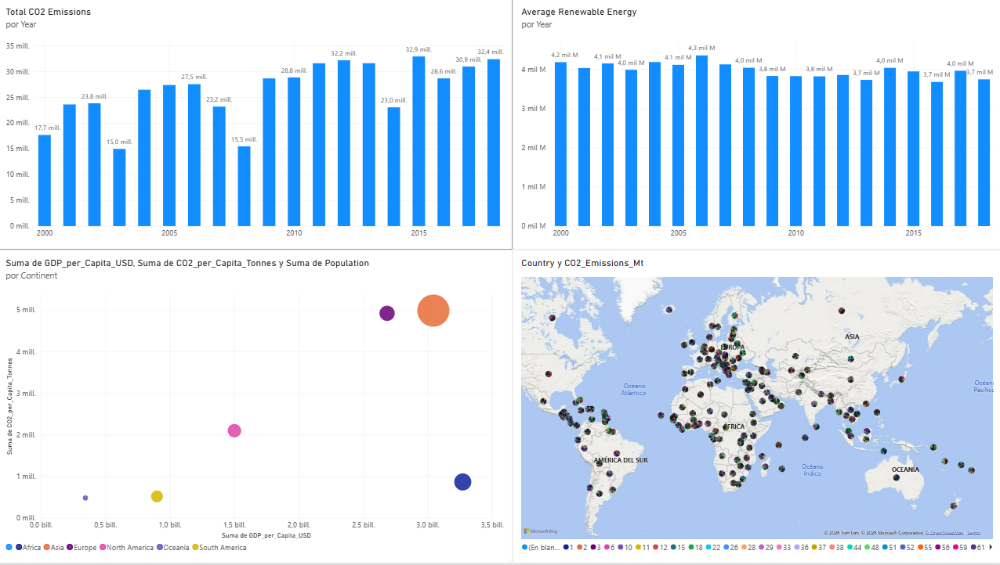
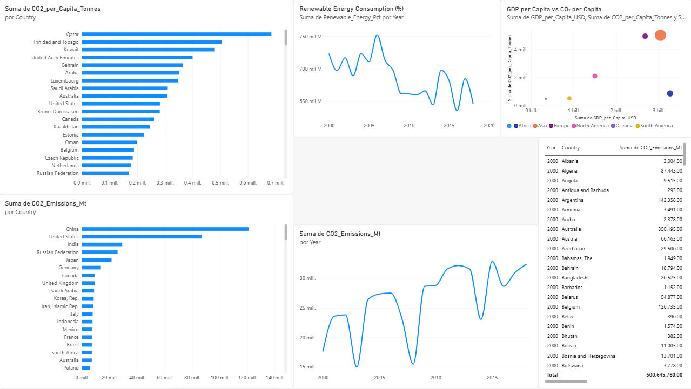
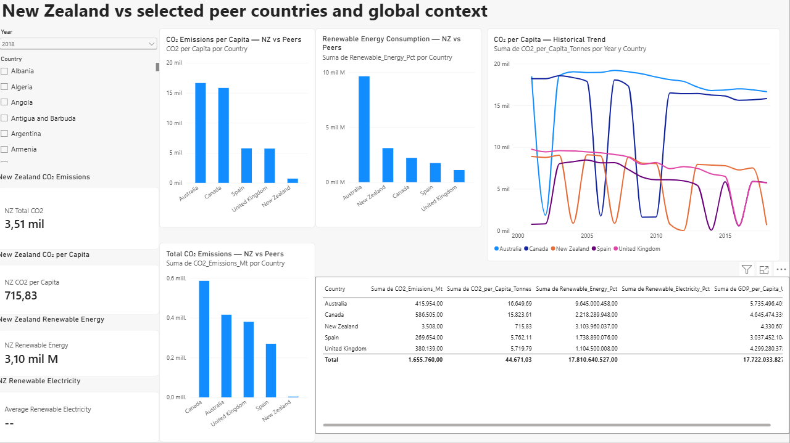

# New Zealand Sustainability Benchmarking

## Executive Overview

A Power BI sustainability benchmarking solution designed to analyse New Zealand's climate, emissions and renewable-energy performance in an international context.

The project transforms multi-country sustainability data into an interactive analytical environment that allows users to explore long-term trends, compare countries and assess New Zealand's relative position across key environmental indicators.

The dashboard is designed from an executive analytics perspective, focusing on **trend identification, benchmarking and decision support** rather than simply presenting descriptive statistics.

---

## Business Question

### How does New Zealand's sustainability performance compare with international benchmarks?

The project addresses a set of questions relevant to sustainability, strategy and ESG teams:

* How have CO₂ emissions evolved over time?
* How does New Zealand compare with other countries?
* How does CO₂ emissions per capita differ across countries?
* How significant is renewable energy in different markets?
* How does New Zealand's renewable-energy performance compare internationally?
* Which countries present relevant benchmarks for New Zealand?

---

## Project Objectives

The main objectives are to:

1. Analyse long-term climate and emissions trends.
2. Compare CO₂ emissions across countries.
3. Analyse CO₂ emissions on a per-capita basis.
4. Examine renewable-energy performance.
5. Provide an interactive country benchmarking environment.
6. Enable focused analysis of New Zealand.
7. Transform complex sustainability data into an executive-friendly analytical interface.

---

## Dashboard Structure

The Power BI report contains three analytical pages.

### 01 — Executive Climate Overview

Provides a high-level view of the sustainability dataset.

The page focuses on:

* CO₂ emissions trends
* Renewable-energy indicators
* Country and regional comparisons
* Population and economic context
* CO₂ per-capita analysis

The purpose of this page is to provide a rapid overview of the environmental landscape before moving into more detailed analysis.

---

### 02 — Emissions & Energy Performance

This page moves from overview to comparative analysis.

It focuses on:

* CO₂ emissions trends
* CO₂ emissions per capita
* Country-level comparisons
* Renewable-energy performance
* Energy-related indicators
* Detailed country analysis

The page allows the user to investigate differences between countries and identify patterns that are not visible from aggregate global trends.

---

### 03 — New Zealand Benchmark

The final page focuses specifically on New Zealand.

It provides dedicated indicators for:

* Total CO₂ emissions
* CO₂ emissions per capita
* Renewable energy
* Renewable electricity
* Country comparison
* Year selection
* Sustainability benchmarking

This page converts the wider international dataset into a focused New Zealand benchmarking environment.

---

## Dashboard Preview

### Executive Climate Overview



### Emissions & Energy Performance



### New Zealand Benchmark



---

## Key Performance Indicators

The dashboard incorporates sustainability indicators such as:

| KPI                   | Purpose                                   |
| --------------------- | ----------------------------------------- |
| CO₂ Emissions         | Monitor absolute emissions                |
| CO₂ per Capita        | Normalise emissions by population         |
| Renewable Energy      | Assess renewable-energy contribution      |
| Renewable Electricity | Analyse renewable electricity performance |
| Population            | Provide demographic context               |
| GDP per Capita        | Provide economic context                  |

The combination of absolute and normalised indicators is important because absolute emissions alone can be misleading when comparing countries with substantially different population sizes or economic structures.

---

## Analytical Approach

The project follows a structured BI workflow:

```text
Raw Sustainability Data
        ↓
Data Cleaning
        ↓
Power Query Transformation
        ↓
Data Modelling
        ↓
DAX Measures
        ↓
Interactive Visualisation
        ↓
Country Benchmarking
        ↓
Executive Insights
```

---

## Data Preparation

Power Query was used to prepare the analytical dataset before visualisation.

The preparation process focused on:

* Data-type standardisation
* Cleaning inconsistent values
* Handling missing values
* Preparing numerical indicators
* Structuring country and year fields
* Preparing the dataset for time-series analysis
* Ensuring compatibility with DAX calculations

Power Query was selected because the transformations form part of the reusable BI data-preparation layer rather than a one-off external preprocessing script.

---

## Data Modelling

The Power BI model was designed to support:

* Time-based analysis
* Country comparisons
* Benchmarking
* KPI calculations
* Interactive filtering

The model separates the responsibilities of data preparation, analytical calculation and visual presentation.

---

## DAX & Analytical Logic

DAX measures were used to create analytical KPIs and dynamic calculations.

The project demonstrates the use of DAX for:

* Aggregation
* Average calculations
* Time-based analysis
* Per-capita indicators
* Dynamic KPI behaviour
* Filter-context analysis

This allows the dashboard to respond dynamically to country and year selections.

---

## Visualisation Strategy

The dashboard uses visualisations selected according to the analytical question.

### Trend analysis

Line and time-series visualisations are used to identify changes over time.

### Country comparison

Bar and column charts are used to compare countries because they make differences easier to interpret than circular visualisations.

### KPI monitoring

Card-style visuals provide high-level indicators that can be understood quickly.

### Interactive analysis

Slicers allow users to change country and time context without creating separate static reports.

---

## Business Value

The project demonstrates how sustainability data can be transformed from a large multi-country dataset into an analytical environment suitable for:

* Sustainability teams
* ESG analysts
* Strategy teams
* Environmental analysts
* Business intelligence teams
* Management reporting

The New Zealand benchmark page is particularly relevant for organisations interested in understanding New Zealand's position within the wider international sustainability landscape.

---

## Key Skills Demonstrated

### Technical

* Power BI
* Power Query
* DAX
* Data Modelling
* Data Visualisation
* KPI Development
* Time-Series Analysis
* Comparative Analytics

### Domain

* Climate Analytics
* Emissions Analytics
* Renewable Energy
* Sustainability
* ESG
* Environmental Benchmarking

### Business

* Executive Reporting
* KPI Design
* Benchmarking
* Decision Support
* Data Storytelling

---

## Limitations

This project is intended as a portfolio analytics case study.

The underlying datasets may contain differences in methodology, availability and reporting coverage across countries and years. Therefore, comparisons should be interpreted as analytical benchmarks rather than as definitive assessments of national sustainability performance.

---

## Future Development

Potential extensions include:

* Scope 1, Scope 2 and Scope 3 emissions analysis
* Additional ESG indicators
* Renewable-energy forecasting
* Carbon-intensity benchmarking
* NZ-specific industry analysis
* Scenario modelling
* Sustainability target tracking
* Automated data refresh
* Integration with live sustainability data sources

---

## Tools

**Power BI · Power Query · DAX · Data Modelling · Sustainability Analytics · ESG Analytics**

---

## Portfolio Context

This project forms part of a broader data analytics portfolio combining:

* Business Intelligence
* Sustainability Analytics
* AI Automation
* Scientific and biological data
* Predictive Analytics

The overall objective is to demonstrate the ability to combine **technical analytics capabilities with scientific and sustainability domain knowledge**.
